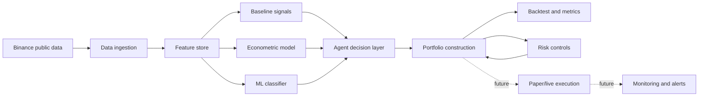

# AI Crypto Hedge Fund CMF

Automated research MVP for crypto portfolio construction, risk control, and AI-assisted allocation.

Implemented output:

- reproducible notebook;
- modular Python package;
- committed reports and figures;
- ignored full 120-pair data bundle documented by checksum.

Core benchmark:

- BTCUSDT for single-asset tests;
- equal-weight large universe for 100+ pair allocation.

---

# 1. System Architecture

Future execution is separated from the implemented research MVP.

---

# 2. AI and Agent Decision Process

Implemented single-asset stack:

- moving-average baseline state;
- rolling econometric return forecast;
- RandomForest next-minute direction classifier;
- deterministic agent vote and risk filter.

Agent gates:

- minimum long votes;
- volatility limit;
- drawdown limit.

Result: RandomForest reduced BTCUSDT drawdown versus buy-and-hold in the test window.

---

# 3. Risk Management

Risk controls implemented:

- train/test split with no shuffling;
- one-period signal lag;
- transaction costs from turnover;
- max drawdown, VaR, CVaR, Sortino, Calmar;
- max asset weight caps;
- volatility-targeted gross exposure for large-universe sparse allocation.

Production controls still needed:

- exchange slippage model;
- order-size limits;
- stale-data block;
- kill switch.

---

# 4. Portfolio Management

Small universe:

- BTC, ETH, BNB, SOL, XRP, ADA;
- equal weight, inverse volatility, constrained max-Sharpe.

Dynamic rebalancing:

- weekly inverse volatility;
- threshold rebalance at 2 percentage-point drift.

Large universe:

- 120 pairs;
- weekly top-20 sparse momentum selection;
- 8% max asset weight.

---

# 5. MVP Results: Single Asset

BTCUSDT out-of-sample test:

| Strategy | Return | Sharpe | Max DD |
|---|---:|---:|---:|
| Buy and hold | -11.26% | -0.72 | -28.59% |
| Moving average | -40.40% | -5.81 | -40.91% |
| RandomForest | -6.13% | -4.89 | -6.84% |
| Agent enhanced | -13.21% | -4.39 | -13.99% |

Interpretation:

- ML improved drawdown;
- 1-minute labels remain noisy and cost-sensitive.

---

# 6. MVP Results: 6-Asset Portfolio

Static portfolio selected by highest out-of-sample Sharpe:

| Method | Return | Sharpe | Max DD |
|---|---:|---:|---:|
| Equal weight | -19.41% | -1.25 | -32.85% |
| Inverse volatility | -17.28% | -1.13 | -31.08% |
| Max-Sharpe constrained | -14.97% | -0.96 | -29.31% |

Selected weights:

- ETH 35%;
- BNB 35%;
- XRP 30%.

---

# 7. MVP Results: Dynamic and 120-Pair

Dynamic six-asset test:

- static max-Sharpe remained best by Sharpe;
- weekly inverse-volatility rebalanced 16 times;
- threshold inverse-volatility rebalanced 5 times.

Large universe:

| Strategy | Return | Sharpe | Max DD |
|---|---:|---:|---:|
| 120-pair equal weight | 14.39% | 1.18 | -29.32% |
| Top momentum weekly | 1.49% | 0.41 | -29.80% |
| Risk-adjusted momentum | -3.78% | 0.12 | -27.83% |

Broad diversification beat simple momentum in this window.

---

# 8. Monitoring and Operations

Monitor:

- data freshness and coverage;
- realized costs versus assumed costs;
- turnover and active set stability;
- volatility, drawdown, VaR/CVaR;
- drift between target and actual balances.

Fail-safes:

- stale-data block;
- max turnover per rebalance;
- order rejection handling;
- exchange outage mode;
- manual kill switch.

---

# 9. Status and Roadmap

Implemented:

- data ingestion;
- metrics and backtesting;
- baseline, ML, agent, portfolio, dynamic rebalancing;
- 120-pair sparse allocation;
- final reproducible notebook.

Next:

- external data bundle publication;
- stronger alpha research;
- realistic execution simulator;
- paper trading;
- monitoring dashboard and alerts.
